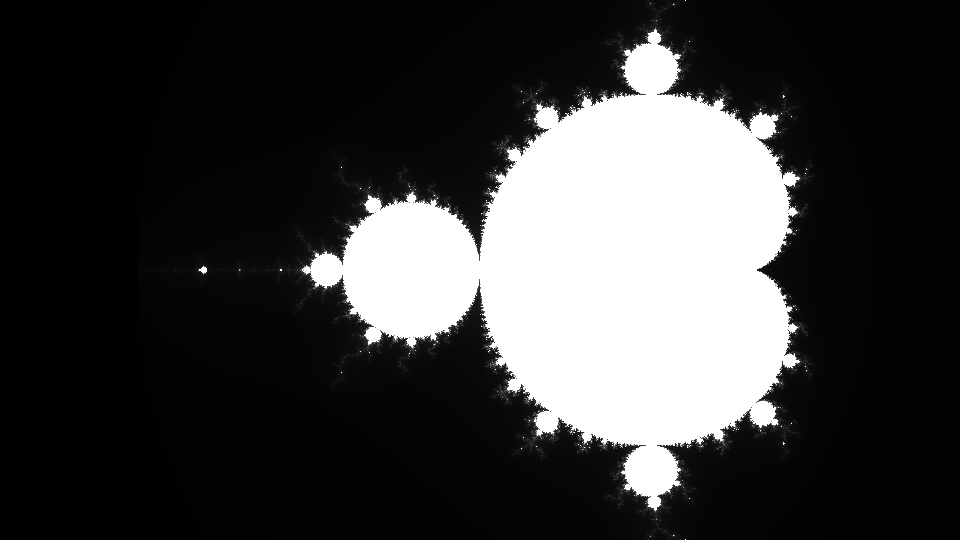

# GPU-accelerated Mandelbrot set generator
A CUDA and OpenCV-based program which generates a visual representation of Mandelbrot set.


## How to use it?
The whole execution process is defined by macros.
In order to modify program parameters, you only need to modify the ```params.h``` file.
```
WIDTH			- width of the output image
HEIGHT			- height of the output image

x_min			- x range of the coordinate system (default: -2.5)
x_max			- x range of the coordinate system (default: 1.0)
y_min			- y range of the coordinate system (default: -1.0)
y_max			- y range of the coordinate system (default: 1.0)

ITERATIONS		- number of loop iterations (more iterations = more details)

r_1 ... b_2		- RGB color codes used for RGB variant

MONOCHROME/RGB	- type of output image

GPU/CPU			- type of function

COUNT_TIME		- CPU variant timer
```

## Performance comparison
The program contains not only a parallel implementation, but also a regular one for comparison.
All the tests were performed on an Intel i7-7700HQ @ 2.80Ghz CPU and Nvidia GTX 1050 GPU.
Below, I listed execution times in seconds for selected values of iterations and 3840x2160 map:

| Iterations | GPU     | CPU     |
|------------|---------|---------|
| 256        | 28.902  | 73.675  |
| 512        | 55.258  | 129.820 |
| 1024       | 107.720 | 274.259 |
| 2048       | 212.058 | 538.790 |

*The GPU seems to heavily outperform CPU for any number of iterations*

## More to come!